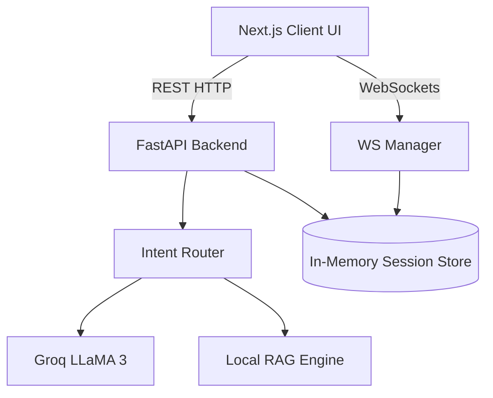
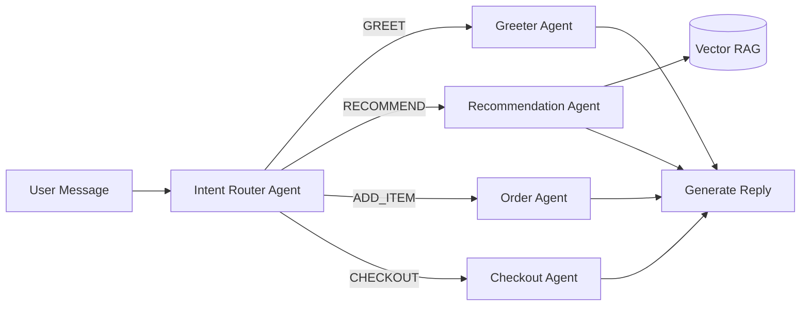
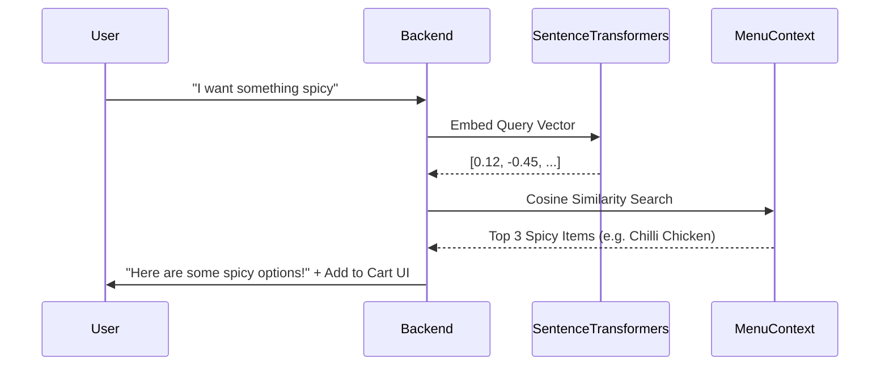
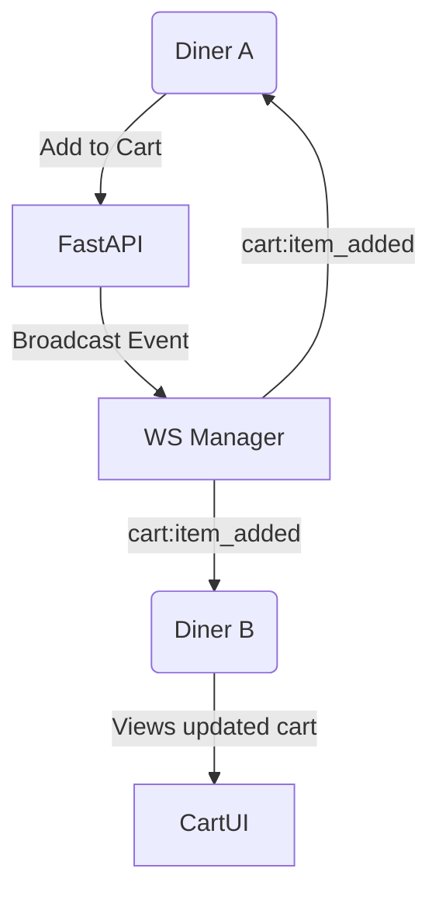
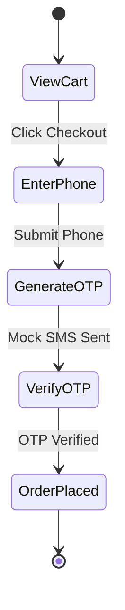

<div align="center">
  
  <h1>Spice Garden — AI Smart Dining Assistant</h1>
  <p><strong>A production-grade, multi-agent conversational dining experience.</strong></p>
  <p>
    <a href="#features">Features</a> •
    <a href="#architecture">Architecture</a> •
    <a href="#setup">Setup</a> •
    <a href="#roadmap">Scaling Roadmap</a>
  </p>
</div>

---

## 🍽️ Overview

**Spice Garden** is an AI-powered smart dining MVP that transforms the restaurant ordering experience. Built with a focus on high demo-impact and sophisticated perceived intelligence, it features a multi-agent orchestration backend, a zero-cost local RAG pipeline for menu retrieval, real-time collaborative group ordering via WebSockets, and a stunning dark-glassmorphism Next.js UI.

Rather than relying on clunky enterprise abstractions, this repository represents an **80/20 startup strategy**: executing the most complex AI flows (intent routing, RAG, simulated checkouts) in a highly optimized, localized manner to create an investor-ready demo out of the box.

---

## ✨ Key Features

- **Multi-Agent Conversational AI**: Uses Groq (LLaMA 3) to dynamically route user queries to specialized agents (Greeter, Recommendation, Upsell, Checkout).
- **Offline RAG Semantic Search**: Embeds menu items instantly using `sentence-transformers` for intelligent, vector-based recommendations (e.g., "I want something healthy and green" → *Palak Paneer*).
- **Collaborative Group Ordering**: Built-in FastAPI WebSockets sync carts in real-time across multiple users at the same table.
- **Dynamic Upsell Engine**: Context-aware upsell suggestions trigger immediately when adding specific items to the cart.
- **Simulated OTP Checkout Flow**: In-memory SMS verification flow for frictionless simulated payments.
- **Hinglish/Multilingual Support**: Intent classification is language-aware.

---

## 🏗️ Architecture

### 1. Overall System Architecture
The application is strictly separated into a Next.js frontend and a FastAPI backend, communicating via REST for stateless AI operations and WebSockets for stateful cart synchronization.



### 2. Multi-Agent Orchestration Flow
When a user sends a message, it isn't just passed to a single LLM. It goes through a deterministic routing pipeline.



### 3. RAG Retrieval Pipeline
To achieve intelligent recommendations without paid Vector DBs, the menu is embedded entirely in RAM on server startup using `sentence-transformers`.



### 4. WebSocket Realtime Sync
Multiple diners at the same table (e.g., `T1`) share the same cart state in real-time.



### 5. OTP Checkout Flow
Simulates a real-world restaurant checkout flow natively in the app.



---

## 🛠️ Setup Instructions

### Prerequisites
- Python 3.10+
- Node.js 18+
- Groq API Key

### Backend Setup
```bash
cd backend
python -m venv venv
source venv/bin/activate
pip install -r requirements.txt

# Create a .env file and add:
# GROQ_API_KEY=your_key_here

uvicorn main:app --port 8000 --reload
```
*Note: On first startup, the `sentence-transformers` model (all-MiniLM-L6-v2) will automatically download (~90MB).*

### Frontend Setup
```bash
cd frontend
npm install

# Create a .env.local file and add:
# NEXT_PUBLIC_API_URL=http://localhost:8000

npm run dev
```
Access the application at `http://localhost:3000`.

---

## 📂 Folder Structure

```
.
├── backend/
│   ├── agents/          # Multi-agent specialized logic (Greeter, Intent, Upsell)
│   ├── data/            # Local JSON menu datasets
│   ├── models/          # Pydantic schema validations
│   ├── rag/             # Local sentence-transformer embeddings & cosine search
│   ├── realtime/        # WebSocket manager and broadcasting logic
│   └── main.py          # FastAPI application entry point
└── frontend/
    ├── app/             # Next.js App Router (pages & layouts)
    ├── components/      # React components (Cart, ChatWindow, MenuGrid)
    ├── lib/             # API client and WebSocket utility
    └── store/           # Zustand global state management
```

---

## 💡 Technical Tradeoffs & MVP Philosophy

To optimize for maximum demo impact under severe time constraints, the following architectural tradeoffs were made:
1. **In-Memory Datastore**: Instead of setting up PostgreSQL/Supabase, the entire session state and WebSocket tracking are maintained in Python memory dictionaries. This eliminates database latency for the demo.
2. **Local RAG over Pinecone**: By loading `sentence-transformers` locally and executing cosine similarity using `numpy`/`scipy` directly in RAM, we bypass external network requests to vector databases, ensuring lightning-fast recommendations.
3. **Optimized Frontend Build**: The frontend relies heavily on client-side state (`Zustand`) rather than complex Server Actions to ensure UI transitions (like Framer Motion chat bubbles) are completely instantaneous.

---

## 📈 Scaling Roadmap

If deploying to production for actual restaurants:
1. **Database Persistence**: Migrate in-memory dictionaries to **Supabase (PostgreSQL)** for order history persistence.
2. **Dedicated Vector DB**: Move the RAG pipeline to **Pinecone** to support scaling the menu across hundreds of restaurant franchises.
3. **Payments Integration**: Replace the simulated OTP flow with a **Stripe / Razorpay** checkout session.
4. **Voice Synthesizer**: Upgrade the browser speech-to-text to **OpenAI Whisper** and integrate **ElevenLabs** for conversational AI audio output.


---

## 📝 License

This project is licensed under the MIT License.
